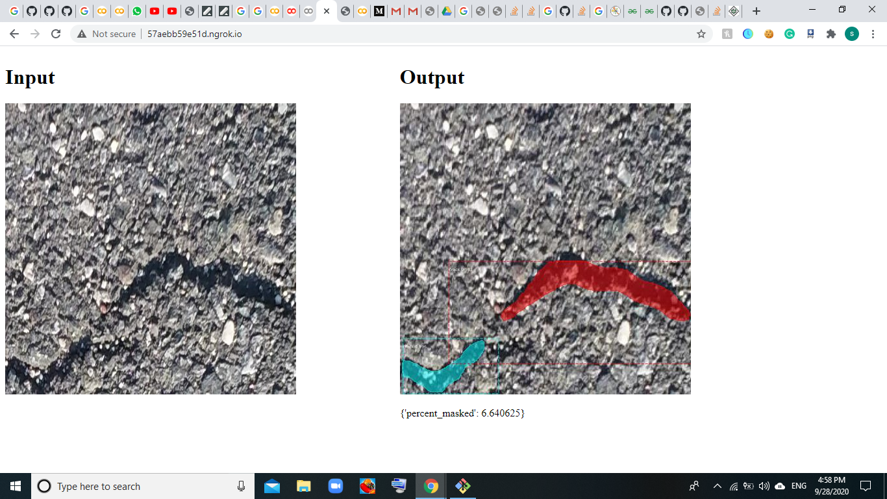

# Instance Segmentation using Mask-RCNN with different backbones on Crack-Data

# Data

**[Dataset used, can be found here](https://drive.google.com/file/d/1xrOqv0-3uMHjZyEUrerOYiYXW_E8SUMP/view?usp=sharing)**

The data is not in the form which is required for the MASK-RCNN, so for a input image, only a combined mask image of cracks is given. I also found that the mask images needs some pre-processing as some of them, seems to contain some noise. So **inspect_and_make_the_data_ready.ipynb** is about this how, I handled the given data, and made it compatible to use it for the MASK-RCNN. 

In intial phase, I assumed that in a image there can be only one bounding box and one mask (which is combined one), even if there are more than 1 diff patches of cracks in  different regions, both will be bound by with only one bounding box and be included in same mask (which is the combined mask).

Then I worked on how to pre-process and remove the noise from the masks and how to get different masks/bounding boxes for different cracks in different portions of image
1- I did opening and closing on the thresholded mask to remove the noise from the mask.
2- I used the concepts of connected components to gets different masks/bounding boxes for different cracks in different positions of image
**I checked the validity of these steps after trying different techniques, on 4-6 different images which I think can cover the space of whole dataset (just by visualizing) :).**

I then pushed final CrackDataset class with remove_noise_and_get_masks and get_thresholded_masks to **CrackDataset_with_its_utils.py** to use further for the MASK-RCNN

**3 Different task folders contains respective codes and their documentation** 

1. Retrain the model to detect an object cracks in the image.
2. Build a simple AI API
3. Modify the network with different 

---

### Task 1. Retrain the model

Let's build our first model! I recommend you to read [the paper](https://arxiv.org/pdf/1703.06870.pdf) and [this article](https://engineering.matterport.com/splash-of-color-instance-segmentation-with-mask-r-cnn-and-tensorflow-7c761e238b46) to understand more in-depth how Mask R-CNN works. If you aren't familiar with this type of models, I highly recommend you to look at the [optional exploration task](#optional-exploration-task).

To build our new model I need a dataset first. So, found and processed a new dataset to train a new model.

---

### Task 2. Build a simple AI API

So, Now  have a model. The world can't wait to use our new Mask R-CNN model! But how can the world interface with our model? We need an API!

Build a simple REST API with flask. An API user is able to post an image to our API and receive the image with drawn mask and the percentage between masks and unmasked pixels.

Example :
    
   
---

### Task 3. Modify the network

Most Mask R-CNN model uses `resnet101` as a backbone, which is a humongous model. According to the original paper, the inference time is lower bounded at 200ms which is very slow.

I have read that MobileNet [is extremely fast, while still remarkably accurate](https://hackernoon.com/creating-insanely-fast-image-classifiers-with-mobilenet-in-tensorflow-f030ce0a2991). Now, I really want to try it out.

The task is to use MobileNet with Mask R-CNN. Compare the performance briefly.

---

##### Author   - Shubham Bindal
##### Email-id - shubhambindal610@gmail.com (you may contact for any query) 

