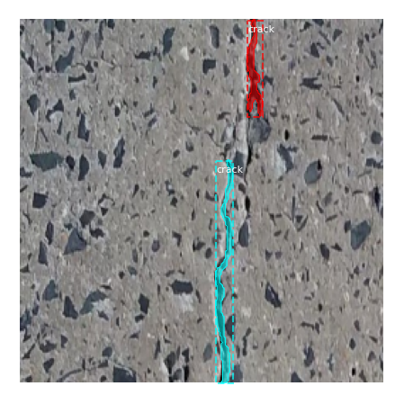
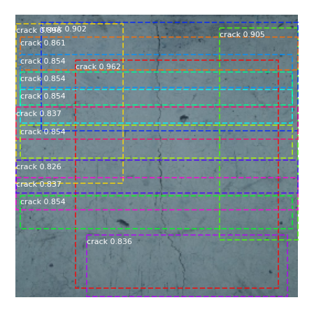
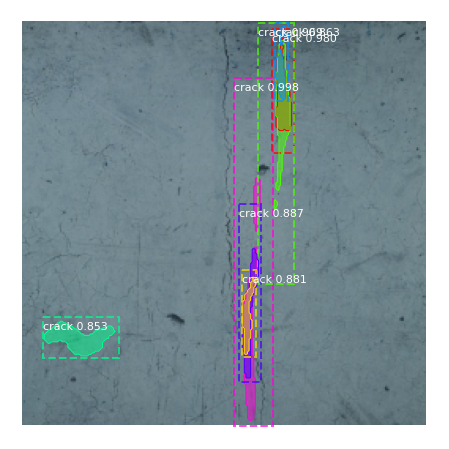

### Task 3. Modify the network
 
 Task 3 is to use MobileNet with Mask R-CNN and then compare its performance with the output model in task 1, MASK R-CNN with Resnet101 backbone.
 But in task 1, I loaded pre-trained MASK R-CNN with Resnet101 on COCO datset and then fine tune the model, but I didn't found any such benchmark nodel for MASK R-CNN with Mobilenet. So it will be unfair if I compare output model in task 1 with a model which hadn't loaded with pre-trained MASK R-CNN weights (for its architecture) (and especially when the number of epochs/steps on which I will train the model is not very large) 
 
 So for this task I train 2 models and train all layers of them, one MASK R-CNN with Resnet101 backbone and other one MASK R-CNN with Mobilenet backbone, both loaded with just their pre-trained backbone weights on imagenet, and I trained both of them on 15 epochs.
 
 Dependencies :

    tensorflow  : 1.15.2
    keras       : 2.3.1
 
 I found that number of parameters is very large in case with ResNet 101 as compared with the case with MobileNet so as the model size. 
 
 After tested on 5 same images. 
 
 1- Average Inference time of MASK R-CNN with MobileNet (0.18188858032226562 sec) is less than that of MASK R-CNN with ResNet 101 backbone (1.3131134033203125). 
 2- Output are far better for MASK R-CNN with ResNet 101 as compared to output on same images with MASK R-CNN with MobileNet, for reference : check folders, 'gt_images' (folder containing ground truth masked images), 'predicted_images_maskrcnn_with_mobilenet' (folder containing predicted masked images for MASK R-CNN with MobileNet) and  'predicted_images_maskrcnn_with_resnet101' (folder containing predicted masked images for MASK R-CNN with ResNet101)   
 
 
 Ground truth masked image 
 
  
 
 Predicted masked images for MASK R-CNN with MobileNet 
 
  
 
 Predicted masked images for MASK R-CNN with ResNet 101 
 
  
 
 **[Weights of MASK R-CNN with MobileNet backbone](https://drive.google.com/file/d/10qKZyef0qKwQNYbmNSXaUoxrMvR2rwwS/view?usp=sharing)** 

 **[Weights of MASK R-CNN with ResNet-101 backbone](https://drive.google.com/file/d/1-BaOnwlVQMcfsPO4l6twAYiXpe17Y-Wy/view?usp=sharing)** 
 
 
 
